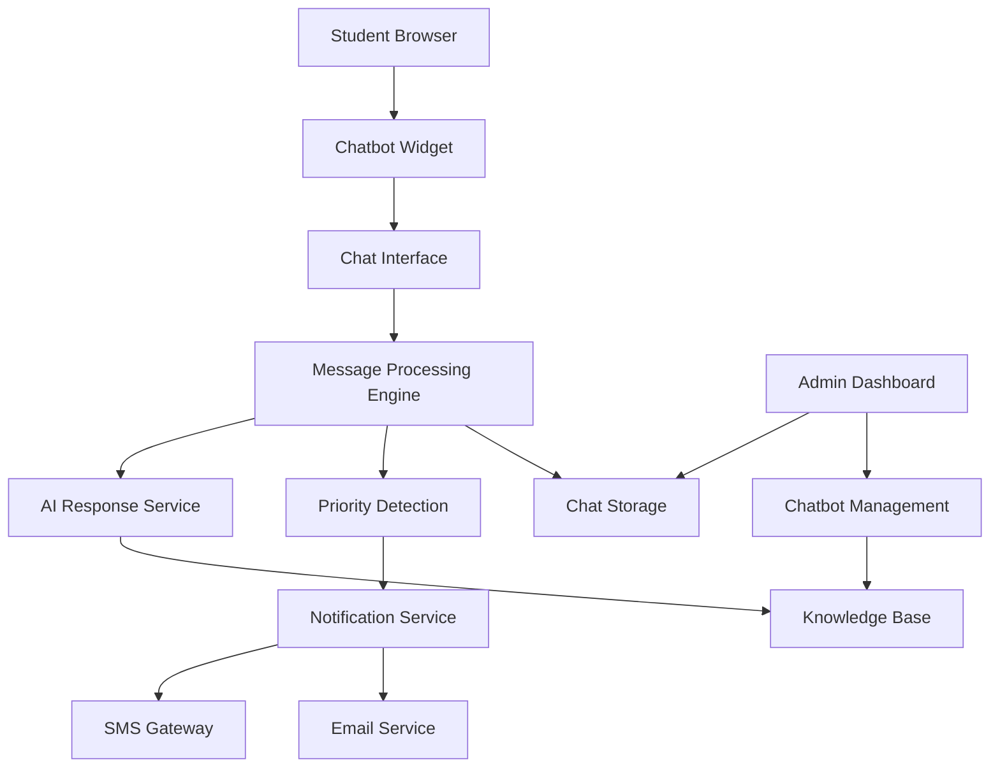

# Design Document

## Overview

The AI Student Chatbot will be integrated into the Saha Institute website as a floating widget that provides instant support to students. The system will use a modern web-based chatbot interface with AI-powered responses, admin notification system, and comprehensive management dashboard. The chatbot will be built using HTML/CSS/JavaScript for the frontend, with integration to AI services for natural language processing and SMS/email services for notifications.

## Architecture

### System Components



### Technology Stack

- **Frontend**: HTML5, CSS3, JavaScript (ES6+)
- **Styling**: Bootstrap 5 (consistent with existing site)
- **AI Service**: OpenAI GPT API or similar service
- **Notifications**: Twilio SMS API, EmailJS for email
- **Storage**: LocalStorage for session data, Google Sheets API for persistent storage
- **Icons**: Font Awesome (already integrated)

## Components and Interfaces

### 1. Chatbot Widget Component

**Location**: Floating widget in bottom-right corner of all pages
**Styling**: Consistent with existing Amity-style theme

```css
.chatbot-widget {
    position: fixed;
    bottom: 20px;
    right: 20px;
    z-index: 9999;
    width: 60px;
    height: 60px;
    background: linear-gradient(135deg, var(--primary-blue), var(--primary-blue-light));
    border-radius: 50%;
    box-shadow: var(--shadow-lg);
    cursor: pointer;
    transition: var(--transition-normal);
}
```

**Features**:
- Animated pulse effect to attract attention
- Notification badge for unread messages
- Smooth expand/collapse animation
- Mobile-responsive design

### 2. Chat Interface Component

**Dimensions**: 
- Desktop: 400px width × 600px height
- Mobile: Full screen overlay

**Structure**:
```html
<div class="chat-container">
    <div class="chat-header">
        <div class="chat-title">Saha Institute Assistant</div>
        <div class="chat-controls">
            <button class="minimize-btn"></button>
            <button class="close-btn"></button>
        </div>
    </div>
    <div class="chat-messages"></div>
    <div class="chat-input">
        <input type="text" placeholder="Type your message...">
        <button class="send-btn"></button>
    </div>
</div>
```

### 3. Message Processing Engine

**Core Functions**:
- `processMessage(userInput)`: Main message handler
- `detectIntent(message)`: Categorize user queries
- `generateResponse(intent, context)`: Create appropriate responses
- `checkPriorityLevel(message)`: Determine if admin notification needed

**Message Categories**:
- Course inquiries (B.Ed, LLB, MBA)
- Admission procedures
- Fee information
- Contact details
- General questions
- Priority/urgent queries

### 4. AI Response Service

**Integration**: OpenAI GPT-3.5-turbo API
**Configuration**:
```javascript
const aiConfig = {
    model: "gpt-3.5-turbo",
    temperature: 0.7,
    max_tokens: 150,
    system_prompt: `You are a helpful assistant for Saha Institute of Management and Technology. 
    Provide accurate information about B.Ed, LLB, and MBA programs. Be friendly and professional.`
};
```

**Knowledge Base Integration**:
- Course details from existing website content
- Admission procedures and eligibility
- Fee structures and payment options
- Contact information and location
- Faculty information

### 5. Admin Notification System

**Priority Detection Logic**:
```javascript
const priorityKeywords = [
    'urgent', 'emergency', 'complaint', 'problem', 'issue',
    'admission deadline', 'fee payment', 'document verification',
    'contact number', 'email', 'phone'
];
```

**Notification Triggers**:
- Student provides contact information
- Keywords indicating urgency detected
- Student asks for human assistance
- Multiple unanswered questions in sequence

**SMS Integration** (Twilio):
```javascript
const smsConfig = {
    accountSid: 'your_account_sid',
    authToken: 'your_auth_token',
    fromNumber: '+1234567890',
    toNumber: '+919871261719' // Admin number
};
```

### 6. Admin Dashboard Integration

**New Section in admin-dashboard.html**:
- Chat logs viewer
- Knowledge base editor
- Response templates manager
- Notification settings
- Analytics dashboard

**Database Schema** (Google Sheets):
```
Chat_Logs:
- timestamp
- session_id
- user_message
- bot_response
- priority_level
- admin_notified

Knowledge_Base:
- category
- question
- answer
- keywords
- last_updated
```

## Data Models

### Chat Session Model
```javascript
class ChatSession {
    constructor() {
        this.sessionId = generateUniqueId();
        this.messages = [];
        this.context = {};
        this.startTime = new Date();
        this.isActive = true;
    }
}
```

### Message Model
```javascript
class Message {
    constructor(content, sender, timestamp = new Date()) {
        this.content = content;
        this.sender = sender; // 'user' or 'bot'
        this.timestamp = timestamp;
        this.id = generateUniqueId();
    }
}
```

### Knowledge Base Entry Model
```javascript
class KnowledgeEntry {
    constructor(category, question, answer, keywords) {
        this.category = category;
        this.question = question;
        this.answer = answer;
        this.keywords = keywords;
        this.lastUpdated = new Date();
    }
}
```

## Error Handling

### Connection Errors
- Fallback to predefined responses when AI service unavailable
- Graceful degradation with basic keyword matching
- Clear error messages to users
- Automatic retry mechanism with exponential backoff

### API Rate Limiting
- Request queuing system
- Response caching for common queries
- Fallback to local knowledge base

### User Input Validation
- Sanitize user inputs to prevent XSS
- Handle empty messages and special characters
- Implement spam protection (rate limiting per session)

## Testing Strategy

### Unit Testing
- Message processing functions
- AI response generation
- Priority detection algorithm
- Notification system components

### Integration Testing
- AI API connectivity
- SMS/Email service integration
- Admin dashboard functionality
- Cross-browser compatibility

### User Acceptance Testing
- Student interaction flows
- Admin notification workflows
- Mobile responsiveness
- Accessibility compliance

### Performance Testing
- Response time optimization (< 3 seconds)
- Concurrent user handling
- Memory usage monitoring
- API rate limit testing

## Security Considerations

### Data Privacy
- No storage of personal information without consent
- Session data encryption
- GDPR compliance for EU users
- Clear privacy policy integration

### API Security
- Secure API key management
- Request authentication
- Rate limiting implementation
- Input sanitization

### Admin Access
- Secure admin authentication
- Role-based access control
- Audit logging for admin actions
- Secure notification channels

## Implementation Phases

### Phase 1: Basic Chatbot Widget
- Floating widget implementation
- Basic chat interface
- Simple keyword-based responses
- Integration with existing website styling

### Phase 2: AI Integration
- OpenAI API integration
- Context-aware responses
- Knowledge base implementation
- Response quality optimization

### Phase 3: Admin Features
- Notification system implementation
- Admin dashboard integration
- Chat logs and analytics
- Knowledge base management

### Phase 4: Advanced Features
- Multi-language support
- Voice message support
- File upload capability
- Advanced analytics and reporting